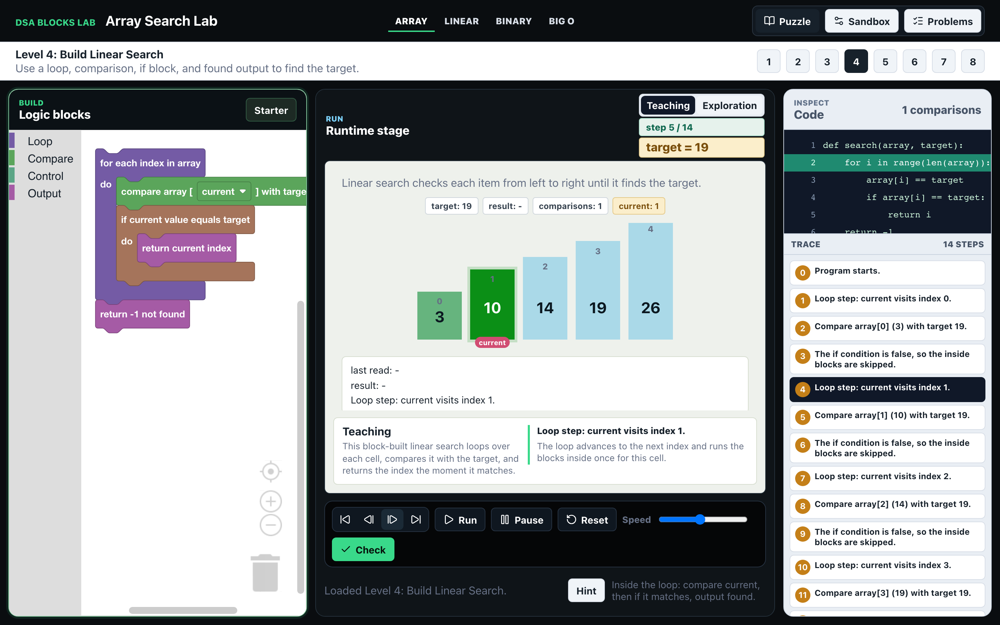
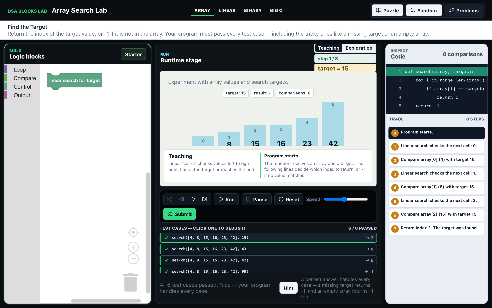
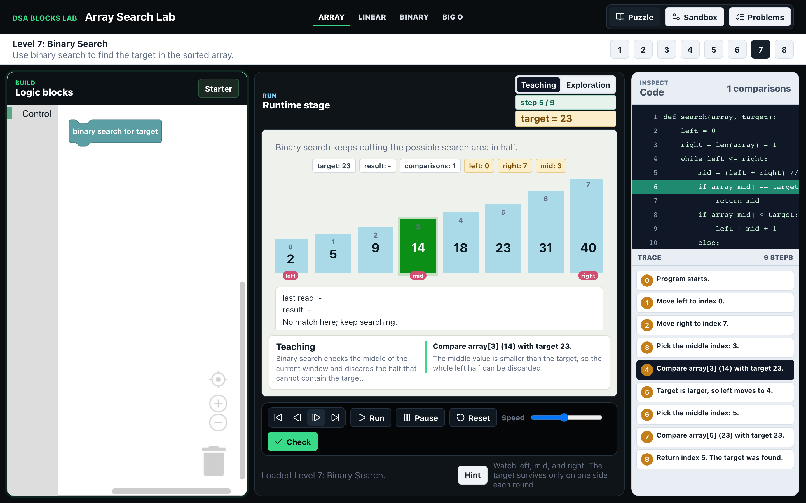

# DSA Blocks Lab

**A browser tool for learning data structures & algorithms by *building* them — not just watching.**

You assemble an algorithm out of drag-and-drop blocks and watch it run step by step, with the
generated code, the memory state, the line highlight, and a plain-English explanation all staying
in sync. It's the rigor of [VisuAlgo](https://visualgo.net) fused with the hands-on feel of Scratch,
aimed at the moment between *"I sort of get it"* and *"I can actually build it."*

<p>
  
  
  
  
  
</p>



*Level 4: the learner has **built** linear search from blocks (left). As it runs, the generated
code highlights line 2, the array cell being visited turns green with its `current` pointer, the
explanation narrates the step, and the trace on the right lists every operation — all from a single
playhead.*

---

## The idea

Beginners hit a wall with algorithms for two reasons:

- **Watching isn't understanding.** Animated visualizers make you a spectator — you watch someone
  else's binary search run, but you never build one, so the understanding evaporates at the blank
  editor.
- **The blank editor is too steep.** Coding platforms assume you can already write correct code, so
  syntax and tooling swamp the actual idea.

DSA Blocks Lab is the missing middle: you **construct** the algorithm (so you own it) out of blocks
(so you can start), and the tool shows you **why each step changes the state** (so you build a real
mental model). Execution uses a safe internal instruction model — the app **never runs arbitrary
user code**; the code panel is a readable *reveal*, not an interpreter.

## Features

- **Build, don't watch** — snap together loops, comparisons, conditionals and returns; the algorithm
  is yours, not a black box with a play button.
- **Five surfaces, one truth** — blocks ↔ generated Python ↔ memory visualization ↔ line/cell
  highlight ↔ explanation, synchronized on every step.
- **VCR-style scrubbing** — jump to start/end, step forward *and backward*, replay any point.
- **Three modes** — a **Puzzle** curriculum (8 levels, arrays → search → Big-O intuition), a free
  **Sandbox**, and a **Problems** mode that grades your program against test cases.
- **Honest by design** — every visible feature either works correctly or plainly says it isn't ready.
  No fake highlights, no confidently-wrong explanations. (Enforced with tests, not vibes.)

### Problems mode — the LeetCode loop

Build a solution, **Submit** it against a battery of test cases, then click any failing case to load
it back into the visualization and **step through exactly where your logic breaks.**



### Binary search, taught on the same engine



## How it works

The app is driven by a single deterministic interpreter. Everything else derives from it, which is
why the visualization, teaching, and scrubbing all stay consistent for free.

| Module | Responsibility |
|---|---|
| `src/dsa/engine.ts` | Deterministic interpreter — runs the instruction model, emits a list of state+event **frames**. |
| `src/dsa/blockly.ts` | Custom blocks, the block→instruction parser, and readable-Python generation with an instruction→line map. |
| `src/dsa/learningSupport.ts` | The sync brain — maps each frame to the code line to highlight and the explanation to show, and honestly classifies teaching support. |
| `src/dsa/problems.ts` | The LeetCode layer — a pure `gradeProgram` that runs the built program against each test case. |
| `src/App.tsx` | App shell — modes, controls, memory view, trace, and the transport. |

A design goal was **one engine, not N bespoke ones**: adding Binary Search teaching required *zero*
changes to the execution engine, and grading a program against test cases is just repeated execution.

## Run it locally

```bash
npm install
npm run dev
```

Then open the URL Vite prints (usually `http://localhost:5173`).

## Testing

```bash
npm test        # 50 tests: engine traces, block parsing, code-sync contracts, grading
npm run build   # type-check + production build
npm run lint
```

The test suite pins the **synchronization contract** — for each execution frame it asserts the
correct code line is highlighted and the explanation matches the operation — so the teaching can't
silently drift out of sync when the engine or code generation changes.

## Tech stack

Vite · React 19 · TypeScript (strict) · Blockly · Vitest · ESLint. ~2,600 LOC.

## Roadmap

- ✅ Synchronized teaching for single-block linear, block-built linear, and binary search
- ✅ 8-level Puzzle curriculum + Sandbox
- ✅ VCR-style trace scrubbing
- ✅ Problems mode: build → submit → grade → debug-the-failing-case
- ⬜ More problems + a problem picker
- ⬜ Wider algorithm surface (e.g. sorting) — intentionally deferred behind the LeetCode loop

## License

[MIT](LICENSE)

---

<sub>Built as a learning-tools exploration. Development was AI-assisted (commits are co-authored),
with a deliberately strict quality bar: no feature ships that looks like it works but doesn't.</sub>
